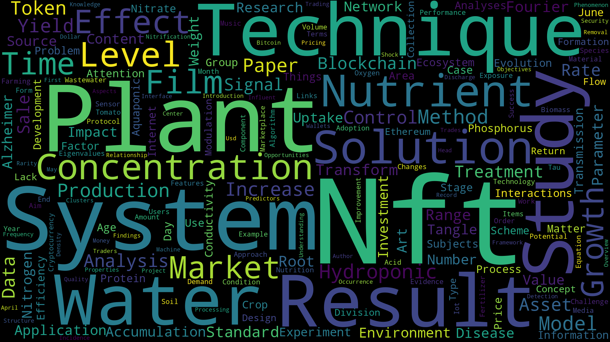
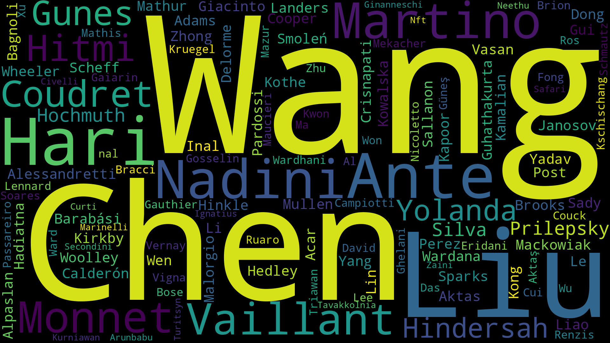
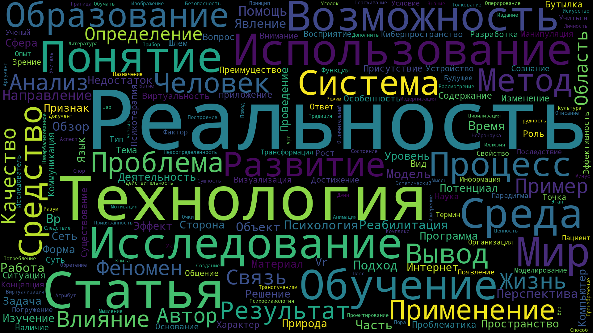
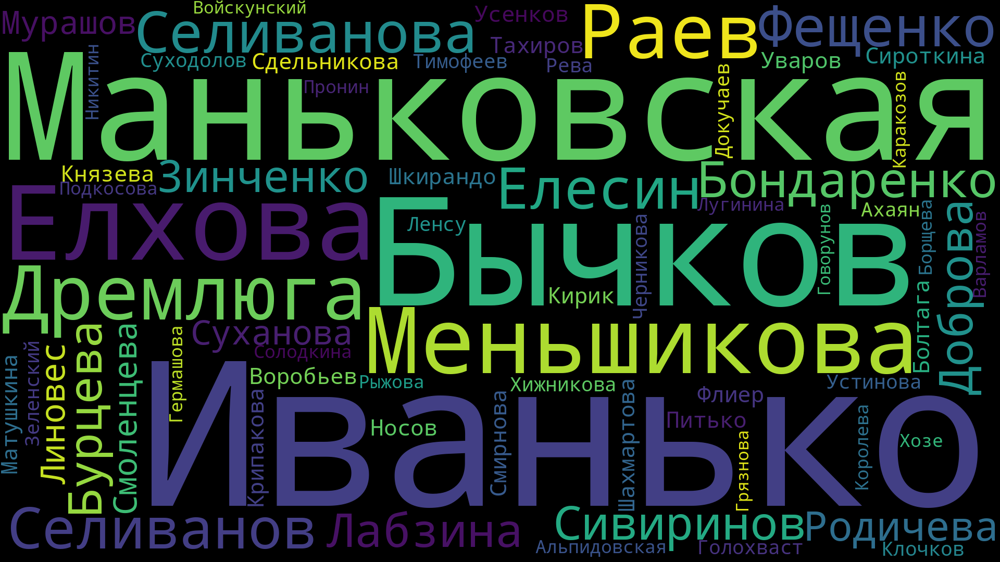

<h1 align="center">Scholar Wordcloud</h1>

--------

Create wordclouds of tags and people by query based on annotations of Google Scholar articles.


*TAGS wordcloud by 'NFT' query (5 pages)*


*PEOPLE wordcloud by 'NFT' query (5 pages)*


*TAGS wordcloud by 'виртуальная реальность' query (5 pages)*


*PEOPLE wordcloud by 'виртуальная реальность' query (5 pages)*

## How it works

* Opens fake browser at https://scholar.google.com/
* Enters query and clicks search
  * You may be forced to enter captcha 1-2 times at most during this stage
* Parses articles
* Visits sites one by one in order to try to extract more verbose abstracts 
  * Uses default abstract from Google Scholar itself on failure
* Generates wordclouds
  * Uses nouns from annotation as words for TAGS wordcloud
  * Uses last names from Google Scholar as words for PEOPLE wordcloud

> This process will repeatedly open fake browsers. For better results you should not disrupt their work.

## Installation

* Install Python 3.10+ and PIP
* Run `pip install -r requirements.txt`
* Run `playwright install`

> The script will download NLTK files on first run

## Usage

```commandline
usage: main.py [-h] -q QUERY [-o OUTPUT] [--width WIDTH] [--height HEIGHT] [-p PAGES]

Generates wordclouds from Google Scholar articles.

options:
  -h, --help            show this help message and exit
  -q QUERY, --query QUERY
                        query text
  -o OUTPUT, --output OUTPUT
                        output directory
  --width WIDTH         wordcloud width
  --height HEIGHT       wordcloud height
  -p PAGES, --pages PAGES
                        number of pages to query and parse
```

The wordclouds will be stored in `tags_wordcloud.png` and  `people_wordcloud.png` files in `OUTPUT` directory.

## Limitations

* Currently properly works with English and Russian languages only